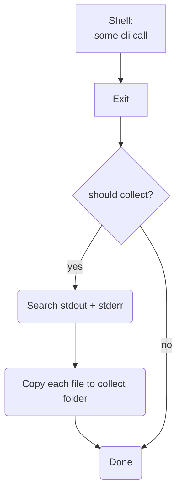

# Log File Collection

Given the nature of pkgtest calling supplemental tools like `corepack`, `typescript`, `<package manager> install`, or
whatever your script tests are using, you can run into a problem where a failure occurs in any of those tools and they 
write out something like `see full logs at something.log`.

Per [Debugging pkgtest](./81-debugging.md), we recommend that you instead use `--ipreserve` and open up the preserved test project to replicate
the failed commands and investigate there.  However, if you are in a CI pipeline where you can't do that or you can't replicate the 
issue when in the project as compared to when run from pkgtest, then you can get pkgtest to scan any of those outputs and 
copy detected log files into a log collection folder for your review.

## How it works

In a nutshell, when we tell pkgtest to perform log file collection, pkgtest will perform processing on every shell call that is does
and will, at the end of execution, copy those log files over to a central location.

As you can see, this is not a free process.  This adds potentially intensive tasks (search time is dependent on the size of the stdio and copy is additionally reliant on the size of the files).  To reiterate, this is a debugging escape hatch on systems where archiving logs is easier than 
interactive debugging.

## CLI Args

There are two cli arguments that you have to provide (and you must provide both):

### `--collectLogFilesOn`

When specified, this lets us know when we will perform the scan of stdio relative to a shell process.  To limit the hit to performance,
you can choose to only scan stdio on shell calls that have a non-zero exit code (`Error`).

### `--collectLogFilesStage`

This allows you to limit the scope where we will scan for log files.  The two recommended stages for most debugging in pkgtest would be:

1. `setup` - This allows you to access tool logs that may have failed exotically on a machine when run by pkgtest

2. `scripts` - Since script tests generally involve calling tools that plug in your package in some way, you may want to collect those logs
    as well.

!!! Question

    The current implementation of log file collection is completely reliant on shell calls reporting their log files as `.log`.  You can think
    about some tests that you might write where you make sure to dump the .log path so that it is also collected

## Where are the log files?

!!! Note

    pkgtest does not create these folders until it has found logs that it can upload to them.

Log files are collected per pkgtest run under the [log file collection directory](./3-environment-vars.md#pkg_test_log_collect_dir).

Each package test run is located in a folder of the type: `pkgtest-run-<timestamp>`

Within that folder, you can drill down in folders that are separated most generally by:

1. Category
      * corepacklatest - the resolving and installation of corepack latest versions
      * setup - the setup of test projects
      * fileTests
      * binTests
      * scriptTests

Within most of those categories (excluting `corepacklatest`), you will find folders that are delineate by their test project:

`entry_number/module_type/package_manager/package_manager_alias` indicates a test project

### For File tests

Within the file tests folder, you will find a further separation of `run_with`.  At this point, you are at the file test suite
level.

The folders in here will then be the names of all files that weere run.

### For Bin Tests

Within the bin tests folder, you will see that each folder is listed as `${cmd}{number in array for command}`.  You can pair this
with your pkgtest config to understand which test you want to check log files for if you have multiple configured test for one
bin command.

### For Script Tests

Within the script tests folder, you are just presented with numbers.  These correspond to the index of the test in the scriptTests
array in your pkgtest.config file.