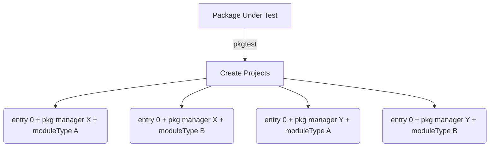
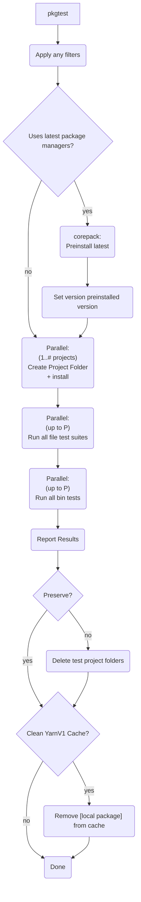
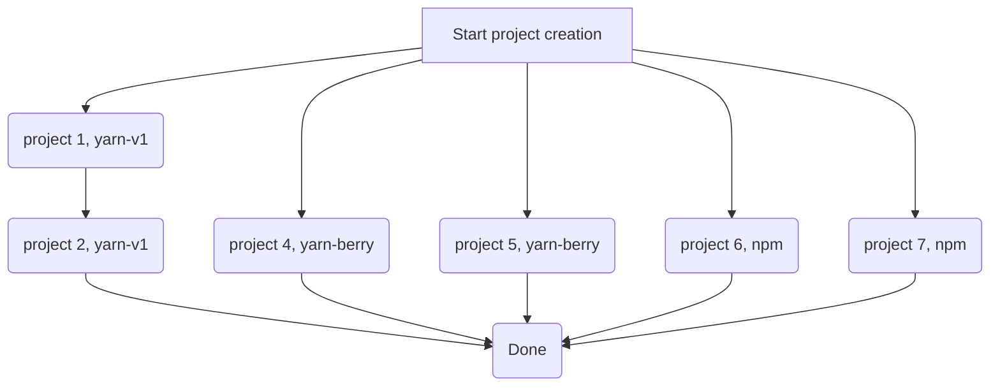
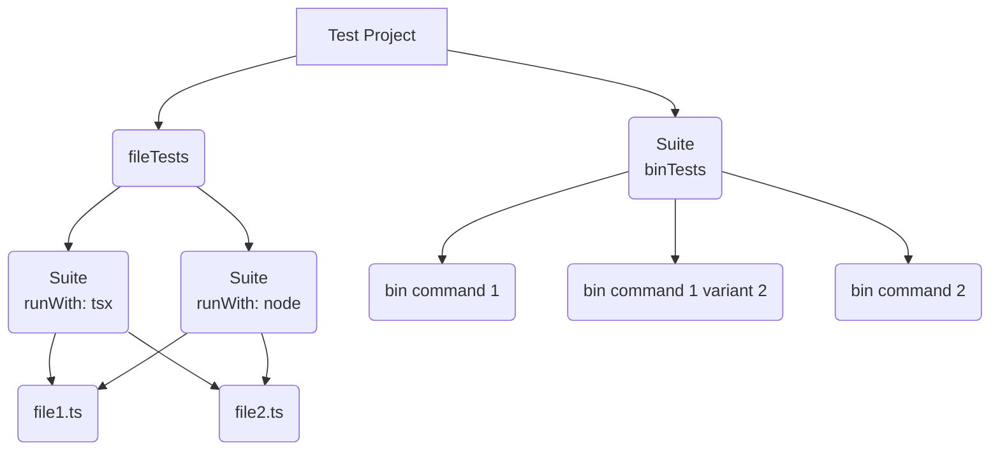

# pkgtest Design

As alluded to in the overview, pkgtest is largely a repeatable abstraction of the manual package importing
process for testing.

Package test is intended to run from a viable npm package directory
and then it will create a series of temporary projects (folders) on the running machine where it will perform installations of the package under test (presuming it has been built) and then run tests.

## Test projects

The following demonstrates the fanout of physical project folders that are created when there is one test entry that requires 2 packages managers and 2 module types (presumably `commonjs` and `esm`).

## Package Installation

### Prerequisite Tools

For all NodeJS package managers (TODO- bun support), corepack is used to download and run the correct version of a package manager.

We expect that:

1. NodeJS
2. Corepack

are already installed on the machine in the correct versions necessary for pkgtest to run them.

As an example, while pkgtest can test support for `yarn-berry@4.6.0`, you would need to run it via `nvm use 18` and `nvm use 20` if you wanted to verify that your package worked with the package manager and each version of NodeJS.

### General pkgtest Flow

The following flow chart shows generally what pkgtest does when it is called:

The main stages are:

1. Applying of any filters to reduce test projects
2. Preinstallation of latest if "latest" versions are used
3. Parallel creation of folders, assets and package manager installs
   1. See that section for some caveats
4. `-p num` file tests run at a time
5. `-p num` bin tests run at a time
6. Deleting of test projects if not preserved
7. Deleting of the local package entry from the yarnv1 cache
   1. This deals with a problem where yarnv1 adds a new entry for every install of a `file:` project

### Installation of latest

Corepack does not have a concept of a fixed latest version.  In other words, if you tell corepack
to use the latest version of a package manager, every corepack-backed
command will perform a latest lookup against the respective package
registry to make sure there isn't a newer version.

Given that pkgtest can run many different configurations of the latest of a package manager, we actually want to get the "latest" version
of a package manager once and then run all pkgtest's with that single version
that was retrieved.

Practically, with corepack, this looks like:

1. Create a temporary empty project
2. Initialize corepack with "packageManager@latest" within it
3. Delete the folder (the latest version is now in corepack cache)
4. Set the version that we use for any "latest" to the version that was actually installed (to use caching)

### Installation of Dependencies in a test project

As detailed in the flow chart above, pkgtest will initialize installation
in each test project directory that is created.  For the most part
this runs asynchronously, however, yarnv-v1 has a problem with multiple
install calls running at the same time and not being able to log on the files.

Because of this, pkgtest is set up to synchronously order all yarn-v1 test project creations while running the other package managers that can install in parallel at the same time.

### Tests run within a test project

Within each of these test projects, pkgtest will then run various shell calls to perform the particular tests.  The following diagram
demonstrates the relation between file tests, bin tests, and files or shell calls that are made:

Interpreting the above, a fileTest entry will result in the same number of test suites as `runWith` entries.  This is because each runWith tool is capable of being run separate of one another on the same file.  Additionally, binTests are single suite that calls a shell script
with the specified commands (or the default for any bin detected
in the project under test's package.json).

## Parallelism in tests

Tests in a given Test Suite are always run synchronously.  This is mainly a decision to avoid
over leveraging system resources since pkgtest is literally spawning new shells
for every test that it runs.  This escapes the single threaded context of NodeJS
and can lead to a quick expansion of shells using each other's resources.

## Parallelism in test suites

pkgtest does allow for parallelizing the number of test suites
that are executed.  By default, (to avoid resource contention on
different systems), pkgtest runs all suites synchronously.  It
is up to the user to specify a number of parallel suites that are
allowed to run.

In reality, `-p 4` leads to 5 separate processes running at a time:

    4 x test suites and their respective shells
    1 x pkgtest async blockingr on the suite calls

## Log File Collection

In order to support issues on CI machines, pkgtest will also scan any stdio 